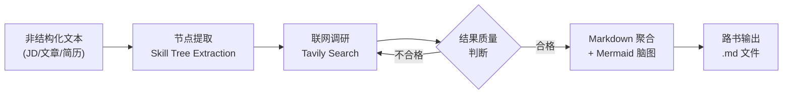
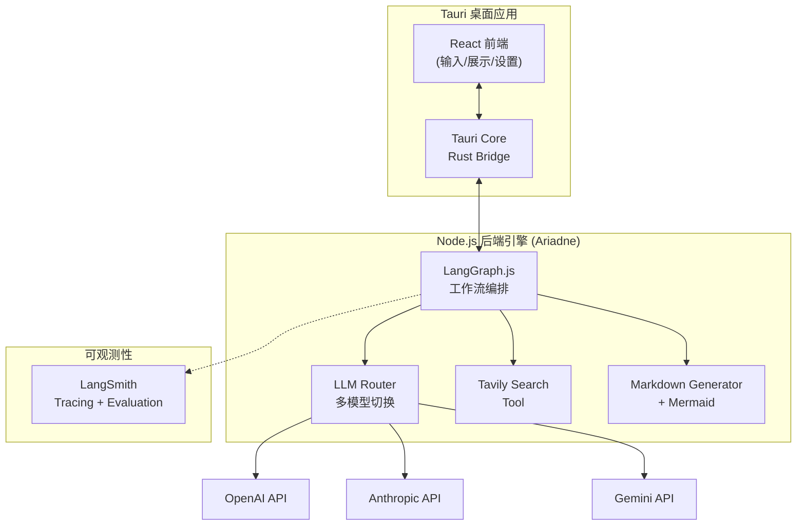
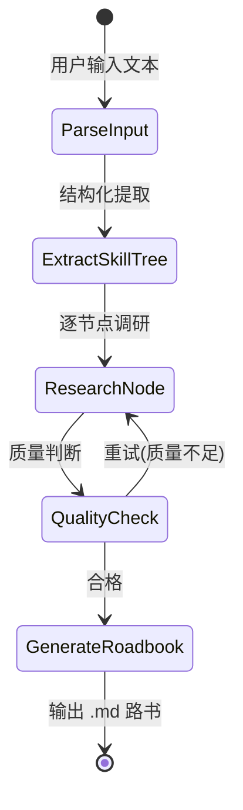

# Roadbook（路书）- 产品需求文档 (PRD)

> **Slogan:** "输入一份 JD，Ariadne 为你生成专属的通关路书。"

---

## 1. 产品概述

### 1.1 背景与痛点

传统开发者转型 AI / VibeCoding 时，面临三大核心痛苦：

- **JD 解析焦虑**：拿到一份 JD，不清楚技能树的优先级和深度要求，盲目学习
- **简历知识断层**：简历上写了但没真正吃透的技术点，面试前需要快速补课
- **新概念扫盲成本**：技术文章中出现的新概念，缺乏结构化的上下文理解路径

### 1.2 产品定位

Roadbook 是一个**主动发散与构建**的 AI 学习路径生成器。区别于被动问答的 RAG 系统，它以一段非结构化文本（JD、技术文章、简历片段）为锚点，向外扩张调研，最终收敛为一份**结构化、教程导向**的学习路书。

### 1.3 命名体系

| 角色 | 名称 | 说明 |
|------|------|------|
| 核心引擎 | **Ariadne** | 希腊神话中指引走出迷宫的线团，代表后端 Agent 编排层 |
| 交付产物 | **路书 (Roadbook)** | 面向用户的产品名，契合"通关指南"工具属性 |

---

## 2. 目标用户

- **主要用户**：传统后端/全栈开发者，正在向 AI 工程方向转型
- **次要用户**：任何需要从非结构化文本中提取结构化学习路径的技术从业者
- **机器用户（新）**：Claude Code、OpenClaw 等 AI coding agent，以及偏好命令行的轻量开发者——通过 CLI 直接调度 Ariadne，将路书生成作为 agent workflow 中的一个工具节点

---

## 3. 用户场景与核心流程

### 场景 A：JD 解析

用户粘贴一份 Node.js/AI 方向的 JD -> Ariadne 提取技能树 -> 联网调研每个技能点 -> 生成带优先级的学习路书

### 场景 B：简历复习

用户粘贴简历中某段项目经历 -> Ariadne 识别涉及的技术栈 -> 调研每个技术的常见面试考点 -> 生成复习路书

### 场景 C：概念扫盲

用户输入一个技术概念（如 "StreamBridge"）-> Ariadne 识别歧义（多语境）-> 结合上下文剪枝 -> 生成该概念的知识图谱路书

### 场景 D：Agent / CLI 调度

Claude Code 或 OpenClaw 在协助用户学习新技术时，直接通过 CLI 调用 Ariadne：
```bash
echo "LangGraph.js" | npx ariadne --format json
# 或
npx ariadne "Node.js 高级后端工程师 JD" --output roadbook.md
```
Ariadne 返回结构化 JSON 或 Markdown，agent 可将其作为上下文继续处理，无需打开 GUI。

### 核心数据流



---

## 4. 功能需求

### MVP1（v0.1）- 核心路径打通

- **F1 - 文本输入**：支持粘贴 JD / 文章 / 自由文本，提供简单的输入界面
- **F2 - 技能树提取**：LLM 从输入文本中提取结构化技能树（Skill -> Sub-skill -> Related Concepts）
- **F3 - 联网调研**：对每个技能节点通过 Tavily 搜索相关教程和资源
- **F4 - 路书生成**：输出一份 Markdown 文档，包含：
  - Mermaid mindmap 脑图（技能树可视化）
  - 每个节点的简要说明 + 推荐学习资源链接
  - 学习优先级建议
- **F5 - 多模型支持**：支持 OpenAI / Anthropic / Gemini 模型切换
- **F6 - 本地应用**：Tauri 桌面端，数据本地存储

### MVP2（v0.2）- 体验增强

- **F7 - Obsidian 双链输出**：生成的路书支持 Obsidian `[[双链]]` 格式，可直接导入 Obsidian vault
- **F8 - 流式输出**：Agent 工作过程中实时展示进度和中间结果
- **F9 - 历史管理**：本地保存历史路书，支持查看和对比
- **F10 - 歧义消解交互**：当检测到多义概念时，交互式让用户选择上下文方向
- **F11 - CLI 一等公民支持**：面向 AI agent 和轻量开发者的命令行接口
  - `--format json`：输出结构化 JSON，供 agent 程序消费
  - `--format markdown`：输出纯 Markdown，适合管道和文件保存
  - stdin 支持：`cat jd.txt | npx ariadne`
  - 语义化 exit code：0 成功 / 1 输入错误 / 2 生成失败
  - 无副作用模式（`--dry-run`）：仅解析技能树，不执行联网调研

### Future（v0.3+）

- Obsidian 插件形态
- 知识图谱持久化与增量更新
- 多路书关联与合并
- 社区分享路书模板

---

## 5. 技术架构

### 5.1 整体架构



### 5.2 技术栈选型

- **桌面框架**：Tauri v2（Rust 底层，轻量原生）
- **前端**：React + TypeScript + TailwindCSS
- **Agent 编排**：LangGraph.js（状态机驱动的多阶段工作流）
- **LLM 接入**：LangChain.js ChatModel 抽象层（支持 OpenAI / Anthropic / Gemini 切换）
- **搜索工具**：Tavily Search API（LangChain 生态首选，专为 AI Agent 设计）
- **数据格式**：JSON Schema 约束 LLM 输出 -> Markdown + Mermaid
- **可观测性**：LangSmith（tracing 全链路追踪 + evaluation 质量评估）
- **本地存储**：SQLite（via Tauri）或直接文件系统（.md 文件）

### 5.3 LangGraph 工作流节点设计



工作流状态 Schema（核心字段）:

```typescript
interface RoadbookState {
  input: string;
  inputType: 'jd' | 'article' | 'resume' | 'concept';
  skillTree: SkillNode[];
  researchResults: Map<string, ResearchResult>;
  roadbookMarkdown: string;
  metadata: {
    model: string;
    searchQueries: number;
    totalTokens: number;
  };
}

interface SkillNode {
  name: string;
  category: string;
  subSkills: string[];
  relatedConcepts: string[];
  priority: 'high' | 'medium' | 'low';
  description?: string;
  resources?: ResourceLink[];
}
```

### 5.4 LangSmith 集成（技术验证重点）

这是项目的重要技术目标之一，需要在 MVP1 中完整接入：

- **Tracing**：全链路追踪每次路书生成的 Agent 执行过程
  - 每个 LangGraph 节点的输入/输出
  - LLM 调用的 prompt / completion / token 用量
  - Tavily 搜索的 query / results
- **Evaluation**：建立路书质量评估体系
  - 自定义 Evaluator：技能树覆盖率、资源链接有效性、结构完整性
  - LLM-as-Judge：路书可读性、教程导向性评分
  - Dataset：收集典型 JD 作为测试集，回归测试 prompt 迭代效果

---

## 6. 里程碑规划

### M0 - 基础骨架（1-2 周）
- 初始化 Tauri + React 项目
- LangGraph.js 基础工作流骨架
- 单模型（OpenAI）跑通 "输入 -> 提取 -> 输出" 最简路径
- LangSmith tracing 接入

### M1 - MVP1 功能闭环（2-3 周）
- 完成完整的 3 阶段工作流（提取 -> 调研 -> 聚合）
- Tavily 搜索集成
- Mermaid 脑图生成
- 多模型切换
- Tauri 桌面端基础 UI（输入框 + Markdown 渲染 + 设置页）

### M2 - 质量打磨（1-2 周）
- LangSmith evaluation pipeline 建立
- Prompt 调优（基于 evaluation 数据驱动）
- UI/UX 打磨
- 错误处理与边界情况

### M3 - MVP2 体验增强
- Obsidian 双链输出
- 流式输出
- 历史管理

---

## 7. 非功能需求

- **隐私**：所有数据本地存储，API Key 本地管理，不经过第三方服务器
- **性能**：单次路书生成控制在 60s 内（取决于搜索深度）
- **离线友好**：无网络时可查看历史路书，但生成需要联网
- **可扩展**：搜索工具、LLM 模型、输出格式均可插拔扩展

---

## 8. 风险与对策

- **搜索质量不稳定**：通过 QualityCheck 节点 + 重试机制兜底，LangSmith evaluation 持续监控
- **LLM 输出格式不稳定**：JSON Schema 强约束 + 解析失败重试
- **多模型能力差异**：evaluation 对比测试，给用户推荐适合的模型
- **Tauri + Node.js 集成复杂度**：考虑 Tauri sidecar 方式运行 Node.js 引擎
