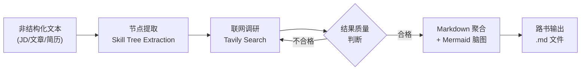
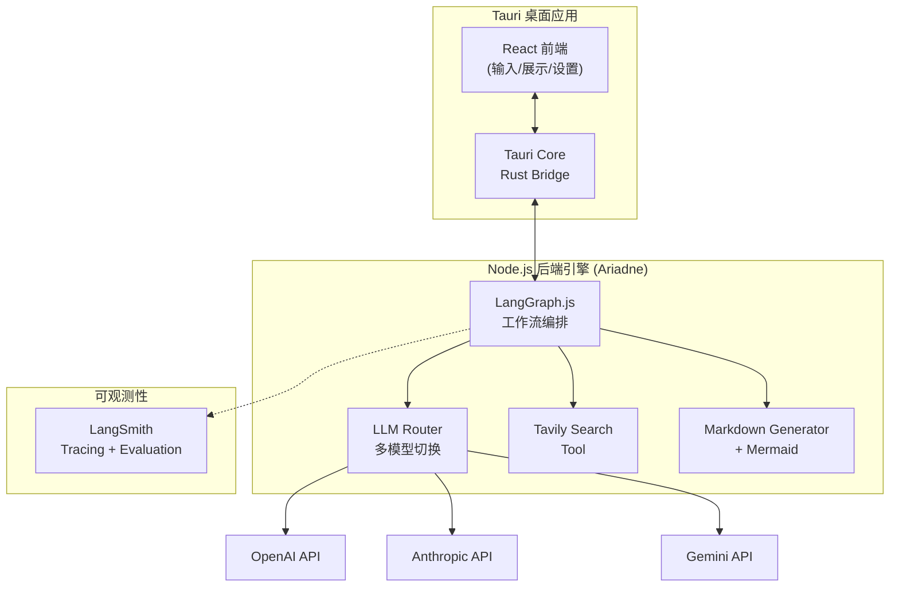
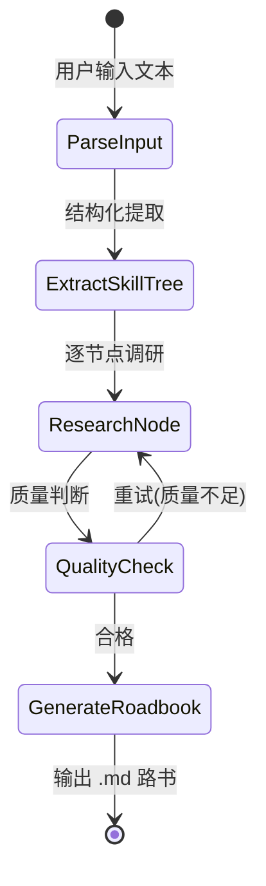

# Roadbook（路书）- 产品需求文档 (PRD)

> **Slogan:** "输入一份 JD，Ariadne 为你生成专属的通关路书。"

---

## 1. 产品概述

### 1.1 背景与痛点

传统开发者转型 AI / VibeCoding 时，面临三大核心痛苦：

- **JD 解析焦虑**：拿到一份 JD，不清楚技能树的优先级和深度要求，盲目学习
- **简历知识断层**：简历上写了但没真正吃透的技术点，面试前需要快速补课
- **新概念扫盲成本**：技术文章中出现的新概念，缺乏结构化的上下文理解路径

### 1.2 产品定位

Roadbook 是一个**主动发散与构建**的 AI 学习路径生成器。区别于被动问答的 RAG 系统，它以一段非结构化文本（JD、技术文章、简历片段）为锚点，向外扩张调研，最终收敛为一份**结构化、教程导向**的学习路书。

每份路书以**工作区（Workspace）**为载体持久化存储，用户可在首页的卡片画廊中管理所有工作区，类似 NotebookLM 的使用范式——每个工作区是一等公民实体，有独立标题、语言、生成时间，可随时打开查看或重新生成。

### 1.3 命名体系

> 调性参考：《禅与摩托车维修艺术》——旅途本身即目的，理解是一种手艺，工具是理解的媒介。

| 层级 | 英文名 | 中文名 | 说明 |
|------|--------|--------|------|
| 引擎 | **Ariadne** | — | 希腊神话中指引走出迷宫的线团；后端 Agent 编排层，负责"编织"路书 |
| 产品 | **Roadbook** | **路书** | 拉力赛导航手册；交付给用户的结构化学习路径文档 |
| 容器 | **Journey** | **旅程** | 一个学习目标或领域，包含多条缘起与对应路书 |
| 输入 | **Source** | **缘起** | 触发旅程的原始材料（JD、文章、概念）；"万事皆有缘起" |

**核心动词**：Ariadne **weaves**（编织）路书——Source 是原料，Roadbook 是织物。

**Slogan**：*每段旅程，皆有缘起。* / *Every journey has its origin.*

---

## 2. 目标用户

- **主要用户**：传统后端/全栈开发者，正在向 AI 工程方向转型
- **次要用户**：任何需要从非结构化文本中提取结构化学习路径的技术从业者
- **机器用户（新）**：Claude Code、OpenClaw 等 AI coding agent，以及偏好命令行的轻量开发者——通过 CLI 直接调度 Ariadne，将路书生成作为 agent workflow 中的一个工具节点

---

## 3. 用户场景与核心流程

### 场景 A：JD 解析

用户粘贴一份 Node.js/AI 方向的 JD -> Ariadne 提取技能树 -> 联网调研每个技能点 -> 生成带优先级的学习路书

### 场景 B：简历复习

用户粘贴简历中某段项目经历 -> Ariadne 识别涉及的技术栈 -> 调研每个技术的常见面试考点 -> 生成复习路书

### 场景 C：概念扫盲

用户输入一个技术概念（如 "StreamBridge"）-> Ariadne 识别歧义（多语境）-> 结合上下文剪枝 -> 生成该概念的知识图谱路书

### 场景 D：Agent / CLI 调度

Claude Code 或 OpenClaw 在协助用户学习新技术时，直接通过 CLI 调用 Ariadne：
```bash
echo "LangGraph.js" | npx ariadne --format json
# 或
npx ariadne "Node.js 高级后端工程师 JD" --output roadbook.md
```
Ariadne 返回结构化 JSON 或 Markdown，agent 可将其作为上下文继续处理，无需打开 GUI。

### 核心心智模型

> **Journey（旅程）** 是对一个知识领域的**持续深耕**，不是一次性生成的报告。

```
外部材料 (Source)          自己产出
     │                        │
     ▼                        ▼
Source Roadmap          Insight List
（自动生成概览）         （想法、感悟、笔记）
     │                        │
     │    选择性消化            │
     └──────────┬─────────────┘
                ▼
         Journey Roadmap
        （持续演进的认知地图）
                ▲
                │ 调研结果回写
        Research Todolist
        （具体的待调研问题 → 自动生成 Research Source）
```

- **Source roadmap**：单篇 source 的结构化概览，自动生成，局部视角
- **Journey roadmap**：workspace 级知识地图，通过选择性消化逐步构建，代表"我真正消化了的认知"
- **Insight**：独立的想法/感悟列表，可选填溯源但不强制
- **Research Todo**：具体的待调研问题，完成后自动生成 Research Source（标记 `origin: "research"`）

> 详细技术方案见 `docs/journey-system-design.md`

### 核心数据模型

```ts
interface Workspace {
  id: string
  title: string
  roadmap: Roadmap | null          // journey 级路书（新增）
  roadmapSourceIds: string[]       // 生成时使用的 source ids，溯源用（新增）
  sources: Source[]
  createdAt: number
  updatedAt: number
}

interface Source {
  id: string
  type: "text" | "url" | "file"
  reference: string                // 原始引用（链接/文件名/原文摘要）
  snapshot: string                 // 摄入时提取的文本快照
  language: string
  roadmap: Roadmap | null          // source 级局部路书
  ingestedAt: number
}

interface Roadmap {
  id: string
  markdown: string
  generatedAt: number
}
```

**两个核心动作**（无需版本系统）：
- **重新摄入**（Source 层）：更新 snapshot，适用于 URL 内容变更、重新上传文件
- **重新生成**（Roadmap 层）：基于当前 snapshot 重跑 Ariadne，覆盖旧路书

所有 Source 类型摄入后统一转为文本 snapshot，Roadmap 只感知文本。

### 核心数据流



---

## 4. 功能需求

### v0.1 - 核心路径 ✅

- **F1** 文本输入（JD / 文章 / 自由文本）
- **F2** 技能树提取（LLM 结构化提取，JSON Schema 约束）
- **F3** 联网调研（Tavily，Top-5 技能点，8s 超时降级）
- **F4** 路书生成（Markdown + Mermaid 脑图）
- **F5** 多模型支持（OpenAI proxy / Anthropic / Gemini，按 provider 路由）
- **F6** 本地应用（Express + React，JSON 文件存储）
- **F12** 多语言输出（路书语言 + UI 语言联动）

### v0.2 - 工作区范式 ✅

- **F13** Journey 首页：卡片画廊，按最近更新排序
- **F14** Workspace 视图：三栏布局（Source 列表 / Roadmap / Chat）
- **F15** Source 管理：添加（text / url / file）、删除
- **F16** Roadmap 管理：生成、重新生成、查看生成时间
- **F8** Chat 流式输出（SSE）：逐 token 打印，支持 roadbook 内联更新
- **F17** URL 抓取 + 文件解析（PDF / DOCX / TXT / 图片 OCR）

### v0.3 - Journey 系统（规划中）

> 详细技术方案见 `docs/journey-system-design.md`

- **F18 - 选择性消化**
  - Source roadmap 支持 segment/node 级别勾选
  - 「消化进 Journey」触发增量 patch（不重新生成全部，LLM 只处理选中部分）
  - Source 展示消化状态：未消化 / 部分消化 / 全部消化
  - 消化后 journey roadmap 在主面板 Journey tab 展示

- **F19 - Insight List**
  - 独立的想法/感悟输入区，随时可记
  - 阅读 source roadmap 时可选中文字 → 「保存为 Insight」（自动填入溯源）
  - Insight 作为 chat 全局上下文的一部分

- **F20 - Research Todolist**
  - 具体的、有明确目标的调研任务
  - 触发 deep research → 自动生成 `origin: "research"` 的 Source
  - Research source 可被消化进 journey roadmap
  - UI 区分 external source（用户添加）vs research source（调研产出）

- **F21 - 多 Source 上下文聊天**
  - Chat 支持选中多个 source（含 research source）+ insight list 作为上下文
  - 渐进式 context 加载（60k chars 预算，按优先级：journey roadmap → source roadmaps → insights → snapshots）

### v0.4 - RAG 分块（规划中）

- Source 摄入时分块（~500 tokens，overlap ~50）
- 向量化存储（`MemoryVectorStore`，zero-dependency）
- Chat 时 query → embed → top-k chunks 替代全文注入
- 优先对超长 source（>10k chars）启用

### Future

- Obsidian 双链输出（`[[双链]]` 格式）
- CLI 完整支持（`--format json`、stdin、语义化 exit code）
- 歧义消解交互
- 社区分享工作区模板

---

## 5. 技术架构

### 5.1 整体架构



### 5.2 技术栈选型

- **桌面框架**：Tauri v2（Rust 底层，轻量原生）
- **前端**：React + TypeScript + TailwindCSS
- **Agent 编排**：LangGraph.js（状态机驱动的多阶段工作流）
- **LLM 接入**：LangChain.js ChatModel 抽象层（支持 OpenAI / Anthropic / Gemini 切换）
- **搜索工具**：Tavily Search API（LangChain 生态首选，专为 AI Agent 设计）
- **数据格式**：JSON Schema 约束 LLM 输出 -> Markdown + Mermaid
- **可观测性**：LangSmith（tracing 全链路追踪 + evaluation 质量评估）
- **本地存储**：SQLite（via Tauri）或直接文件系统（.md 文件）

### 5.3 LangGraph 工作流节点设计



工作流状态 Schema（核心字段）:

```typescript
interface RoadbookState {
  input: string;
  inputType: 'jd' | 'article' | 'resume' | 'concept';
  skillTree: SkillNode[];
  researchResults: Map<string, ResearchResult>;
  roadbookMarkdown: string;
  metadata: {
    model: string;
    searchQueries: number;
    totalTokens: number;
  };
}

interface SkillNode {
  name: string;
  category: string;
  subSkills: string[];
  relatedConcepts: string[];
  priority: 'high' | 'medium' | 'low';
  description?: string;
  resources?: ResourceLink[];
}
```

### 5.4 LangSmith 集成（技术验证重点）

这是项目的重要技术目标之一，需要在 MVP1 中完整接入：

- **Tracing**：全链路追踪每次路书生成的 Agent 执行过程
  - 每个 LangGraph 节点的输入/输出
  - LLM 调用的 prompt / completion / token 用量
  - Tavily 搜索的 query / results
- **Evaluation**：建立路书质量评估体系
  - 自定义 Evaluator：技能树覆盖率、资源链接有效性、结构完整性
  - LLM-as-Judge：路书可读性、教程导向性评分
  - Dataset：收集典型 JD 作为测试集，回归测试 prompt 迭代效果

---

## 6. 里程碑规划

### M0 ✅ 基础骨架
LangGraph 工作流骨架，LangSmith tracing 接入，CLI 可用

### M1 ✅ v0.1 功能闭环
完整 3 阶段工作流（extract → research → generate）、Tavily、Mermaid、多模型、多语言

### M2 ✅ v0.2 工作区范式
Journey 首页卡片画廊、三栏 workspace 视图、Source 管理、Chat SSE 流式、文件/URL 摄入
模型调度修复（proxy 模式路由、Anthropic ANTHROPIC_BASE_URL、默认模型 gemini-3.1-pro-low）

### M3 🔲 v0.3 Journey 系统
- [ ] 数据模型：workspace 加 `insights[]`、`researchTodos[]`；source 加 `origin`、`digestedSegmentIds`
- [ ] 消化 API：`POST /workspaces/:id/digest`（选中 segments → 增量 patch journey roadmap）
- [ ] Journey tab UI（主面板）
- [ ] Insight 输入 + 列表
- [ ] Research todo 增删改 + deep research 触发
- [ ] 多 source chat（`sourceIds[]` + 渐进式 context + insights）

### M4 🔲 v0.4 RAG 分块
向量化存储，query → embed → top-k chunks 上下文注入

### M5 🔲 深度能力
Obsidian 双链、CLI 完整支持、歧义消解

---

## 7. 非功能需求

- **隐私**：所有数据本地存储，API Key 本地管理，不经过第三方服务器
- **性能**：单次路书生成控制在 60s 内（取决于搜索深度）
- **离线友好**：无网络时可查看历史路书，但生成需要联网
- **可扩展**：搜索工具、LLM 模型、输出格式均可插拔扩展

---

## 8. 风险与对策

- **搜索质量不稳定**：通过 QualityCheck 节点 + 重试机制兜底，LangSmith evaluation 持续监控
- **LLM 输出格式不稳定**：JSON Schema 强约束 + 解析失败重试
- **多模型能力差异**：evaluation 对比测试，给用户推荐适合的模型
- **Tauri + Node.js 集成复杂度**：考虑 Tauri sidecar 方式运行 Node.js 引擎
