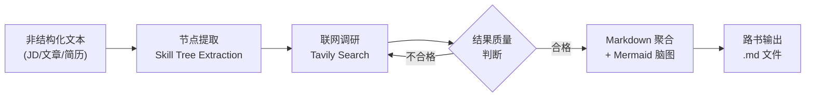
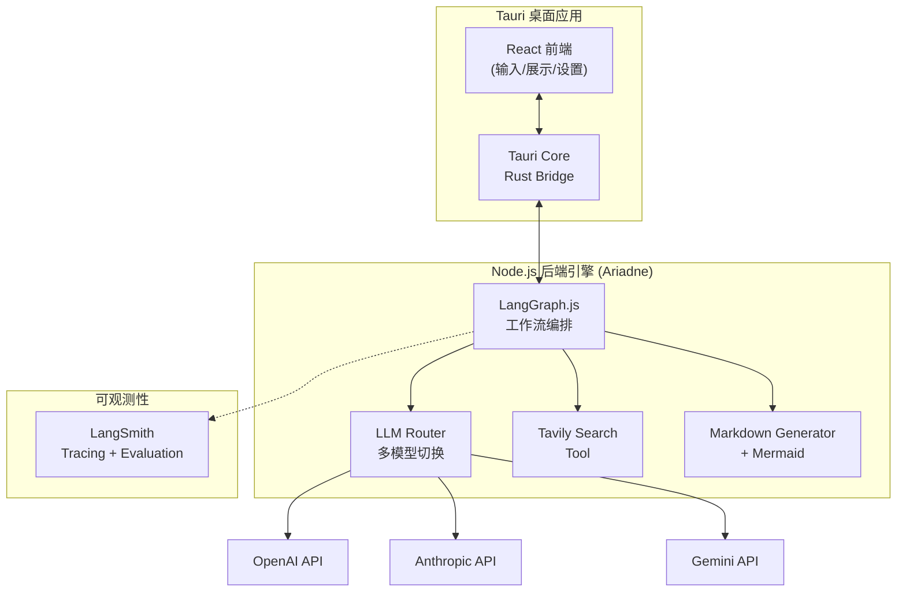
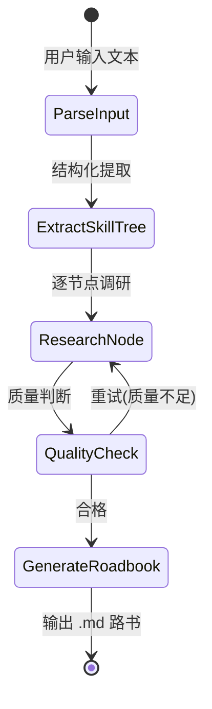

# Roadbook（路书）- 产品需求文档 (PRD)

> **Slogan:** "输入一份 JD，Ariadne 为你生成专属的通关路书。"

---

## 1. 产品概述

### 1.1 背景与痛点

传统开发者转型 AI / VibeCoding 时，面临三大核心痛苦：

- **JD 解析焦虑**：拿到一份 JD，不清楚技能树的优先级和深度要求，盲目学习
- **简历知识断层**：简历上写了但没真正吃透的技术点，面试前需要快速补课
- **新概念扫盲成本**：技术文章中出现的新概念，缺乏结构化的上下文理解路径

### 1.2 产品定位

Roadbook 是一个**主动发散与构建**的 AI 学习路径生成器。区别于被动问答的 RAG 系统，它以一段非结构化文本（JD、技术文章、简历片段）为锚点，向外扩张调研，最终收敛为一份**结构化、教程导向**的学习路书。

每份路书以**工作区（Workspace）**为载体持久化存储，用户可在首页的卡片画廊中管理所有工作区，类似 NotebookLM 的使用范式——每个工作区是一等公民实体，有独立标题、语言、生成时间，可随时打开查看或重新生成。

### 1.3 命名体系

> 调性参考：《禅与摩托车维修艺术》——旅途本身即目的，理解是一种手艺，工具是理解的媒介。

| 层级 | 英文名 | 中文名 | 说明 |
|------|--------|--------|------|
| 引擎 | **Ariadne** | — | 希腊神话中指引走出迷宫的线团；后端 Agent 编排层，负责"编织"路书 |
| 产品 | **Roadbook** | **路书** | 拉力赛导航手册；交付给用户的结构化学习路径文档 |
| 容器 | **Journey** | **旅程** | 一个学习目标或领域，包含多条缘起与对应路书 |
| 输入 | **Source** | **缘起** | 触发旅程的原始材料（JD、文章、概念）；"万事皆有缘起" |

**核心动词**：Ariadne **weaves**（编织）路书——Source 是原料，Roadbook 是织物。

**Slogan**：*每段旅程，皆有缘起。* / *Every journey has its origin.*

---

## 2. 目标用户

- **主要用户**：传统后端/全栈开发者，正在向 AI 工程方向转型
- **次要用户**：任何需要从非结构化文本中提取结构化学习路径的技术从业者
- **机器用户（新）**：Claude Code、OpenClaw 等 AI coding agent，以及偏好命令行的轻量开发者——通过 CLI 直接调度 Ariadne，将路书生成作为 agent workflow 中的一个工具节点

---

## 3. 用户场景与核心流程

### 场景 A：JD 解析

用户粘贴一份 Node.js/AI 方向的 JD -> Ariadne 提取技能树 -> 联网调研每个技能点 -> 生成带优先级的学习路书

### 场景 B：简历复习

用户粘贴简历中某段项目经历 -> Ariadne 识别涉及的技术栈 -> 调研每个技术的常见面试考点 -> 生成复习路书

### 场景 C：概念扫盲

用户输入一个技术概念（如 "StreamBridge"）-> Ariadne 识别歧义（多语境）-> 结合上下文剪枝 -> 生成该概念的知识图谱路书

### 场景 D：Agent / CLI 调度

Claude Code 或 OpenClaw 在协助用户学习新技术时，直接通过 CLI 调用 Ariadne：
```bash
echo "LangGraph.js" | npx ariadne --format json
# 或
npx ariadne "Node.js 高级后端工程师 JD" --output roadbook.md
```
Ariadne 返回结构化 JSON 或 Markdown，agent 可将其作为上下文继续处理，无需打开 GUI。

### 核心数据模型

```
Workspace（域/目标，如"AI Agent 面试备战"）
├── Source（输入源，1:1 对应一份路书）
│   ├── type: text | file | url | video
│   ├── reference: 原始引用（链接/文件名/原文）
│   └── snapshot: 摄入时提取的文本快照（ingested_at）
│       └── Roadmap（一等公民，基于快照生成）
│           ├── skillTree: 技能树
│           ├── markdown: 路书正文
│           └── generated_at
├── Source → Roadmap
└── [可选] Merged Roadmap（从选中 Roadmap 合并派生）
```

**两个核心动作**（无需版本系统）：
- **重新摄入**（Source 层）：更新内容快照，适用于 URL 内容变更、重新上传文件等
- **重新生成**（Roadmap 层）：基于当前快照重跑 Ariadne，覆盖或保留旧路书

所有 Source 类型在摄入后统一变为文本快照，Roadmap 只感知文本，不感知 Source 类型。

### 核心数据流



---

## 4. 功能需求

### MVP1（v0.1）- 核心路径打通 ✅

- **F1 - 文本输入**：支持粘贴 JD / 文章 / 自由文本，提供简单的输入界面
- **F2 - 技能树提取**：LLM 从输入文本中提取结构化技能树（Skill -> Sub-skill -> Related Concepts）
- **F3 - 联网调研**：对每个技能节点通过 Tavily 搜索相关教程和资源
- **F4 - 路书生成**：输出一份 Markdown 文档，包含 Mermaid 脑图、资源链接、优先级建议
- **F5 - 多模型支持**：支持 OpenAI / Anthropic / Gemini 模型切换
- **F6 - 本地应用**：Express + React，数据本地存储
- **F12 - 多语言输出**：用户可配置路书语言，UI 同步切换

### MVP2（v0.2）- 工作区范式重构

核心变化：引入 Workspace > Source > Roadmap 三层模型，Roadmap 成为一等公民。

- **F13 - 工作区首页**：类 NotebookLM 的卡片画廊
  - 每张卡片：工作区标题、Source 数量、最近更新时间
  - 「+ New」入口突出显示
  - 按最近访问排序
- **F14 - 工作区视图**：独立页面，三栏布局
  - 左栏：Source 列表（支持添加多个 Source，类型：text / file / url）
  - 中栏：选中 Source 对应的 Roadmap（Markdown 渲染）
  - 右栏（未来）：Merged Roadmap
- **F15 - Source 管理**
  - 添加 Source（文本输入为 MVP 优先）
  - 重新摄入（更新快照）→ 可触发重新生成
  - 删除 Source（级联删除对应 Roadmap）
- **F16 - Roadmap 管理**
  - 重新生成（基于当前快照重跑 Ariadne）
  - 查看生成时间（隐式版本信息）
- **F8 - 流式输出**：实时展示生成进度

### MVP3（v0.3）- 深度能力

- **F17 - Merged Roadmap**：选择工作区内多个 Roadmap 合并，LLM 做语义去重 + 优先级聚合
- **F7 - Obsidian 双链输出**：生成结果支持 `[[双链]]` 格式
- **F11 - CLI 完整支持**：`--format json`、stdin、语义化 exit code
- **F10 - 歧义消解交互**：多义概念时交互式选择上下文

### Future（v0.4+）

- URL / 文件 / 视频 Source 类型支持
- Obsidian 插件形态
- 社区分享工作区模板

---

## 5. 技术架构

### 5.1 整体架构



### 5.2 技术栈选型

- **桌面框架**：Tauri v2（Rust 底层，轻量原生）
- **前端**：React + TypeScript + TailwindCSS
- **Agent 编排**：LangGraph.js（状态机驱动的多阶段工作流）
- **LLM 接入**：LangChain.js ChatModel 抽象层（支持 OpenAI / Anthropic / Gemini 切换）
- **搜索工具**：Tavily Search API（LangChain 生态首选，专为 AI Agent 设计）
- **数据格式**：JSON Schema 约束 LLM 输出 -> Markdown + Mermaid
- **可观测性**：LangSmith（tracing 全链路追踪 + evaluation 质量评估）
- **本地存储**：SQLite（via Tauri）或直接文件系统（.md 文件）

### 5.3 LangGraph 工作流节点设计



工作流状态 Schema（核心字段）:

```typescript
interface RoadbookState {
  input: string;
  inputType: 'jd' | 'article' | 'resume' | 'concept';
  skillTree: SkillNode[];
  researchResults: Map<string, ResearchResult>;
  roadbookMarkdown: string;
  metadata: {
    model: string;
    searchQueries: number;
    totalTokens: number;
  };
}

interface SkillNode {
  name: string;
  category: string;
  subSkills: string[];
  relatedConcepts: string[];
  priority: 'high' | 'medium' | 'low';
  description?: string;
  resources?: ResourceLink[];
}
```

### 5.4 LangSmith 集成（技术验证重点）

这是项目的重要技术目标之一，需要在 MVP1 中完整接入：

- **Tracing**：全链路追踪每次路书生成的 Agent 执行过程
  - 每个 LangGraph 节点的输入/输出
  - LLM 调用的 prompt / completion / token 用量
  - Tavily 搜索的 query / results
- **Evaluation**：建立路书质量评估体系
  - 自定义 Evaluator：技能树覆盖率、资源链接有效性、结构完整性
  - LLM-as-Judge：路书可读性、教程导向性评分
  - Dataset：收集典型 JD 作为测试集，回归测试 prompt 迭代效果

---

## 6. 里程碑规划

### M0 - 基础骨架 ✅
- 初始化项目，LangGraph.js 工作流骨架，LangSmith tracing 接入

### M1 - MVP1 功能闭环 ✅
- 完整 3 阶段工作流、Tavily 搜索、Mermaid 脑图、多模型切换、多语言输出
- 基础 UI（输入 + Markdown 渲染 + 历史侧边栏）
- CLI 支持，后端历史持久化

### M2 - 工作区范式重构（进行中）
- 工作区首页：卡片画廊 + 新建入口（参考 NotebookLM 布局）
- 工作区独立页面（路由切换）
- 工作区数据模型升级（backend history → workspace store）
- 工作区重命名 / 删除管理

### M3 - 质量打磨
- LangSmith evaluation pipeline
- 流式输出
- Prompt 调优

### M4 - 深度能力
- Obsidian 双链输出
- 工作区内增量调研

---

## 7. 非功能需求

- **隐私**：所有数据本地存储，API Key 本地管理，不经过第三方服务器
- **性能**：单次路书生成控制在 60s 内（取决于搜索深度）
- **离线友好**：无网络时可查看历史路书，但生成需要联网
- **可扩展**：搜索工具、LLM 模型、输出格式均可插拔扩展

---

## 8. 风险与对策

- **搜索质量不稳定**：通过 QualityCheck 节点 + 重试机制兜底，LangSmith evaluation 持续监控
- **LLM 输出格式不稳定**：JSON Schema 强约束 + 解析失败重试
- **多模型能力差异**：evaluation 对比测试，给用户推荐适合的模型
- **Tauri + Node.js 集成复杂度**：考虑 Tauri sidecar 方式运行 Node.js 引擎
